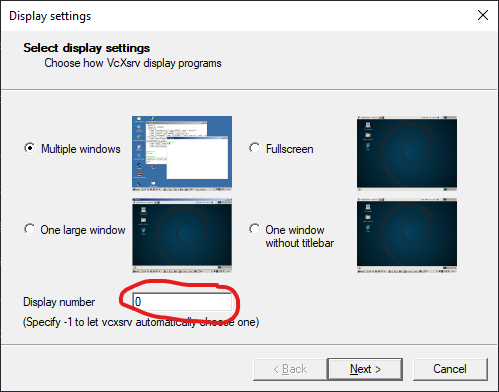
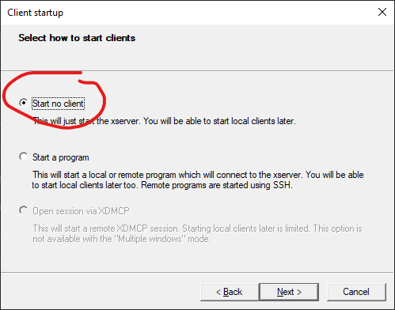

# Running Graphics Programs from Docker

## Windows

Install either [Xming](https://sourceforge.net/projects/xming/) or [VcXsrv](https://sourceforge.net/projects/vcxsrv/).

Once installed run XLaunch

1. Select **Multiple Windows**


2. Set **Display** to **0**



3. Select **Start no client**



4. Check **Disable Access Control**


5. Finish

## Testing a Graphical Program

First get your IPv4 address:

### Windows:
```
ipconfig
```
Under the `Ethernet adapter vEthernet (WSL):` header there should be a line containing `IPv4 Address`.

### Linux:
```
ip route
```

The first line should contain the IP address.

In the terminal run:
```
docker build -f Dockerfile.xeyes . -t xeyes
docker run --rm --name xeyes -e DISPLAY=<your_IPv4_address>:0.0 xeyes:latest
```


If you see the xeyes program appear, that means graphics are working.
(The xeyes example is not technically OpenGL, but more so X11 but allows for a quick test of graphical display from Linux to Windows).

## Running the OpenGL examples

Similarly, to run the OpenGL examples. Build and run them with their respective Dockerfiles.

eg:
```
docker build -f Dockerfile.cubes . -t cubes
docker run --rm --name cubes -e DISPLAY=<your_ipv4_address>:0.0 cubes:latest
```

You can test GLFW by building `Dockerfile.glfw` and the triangle OpenGL example using `Dockerfile.glfw`.
