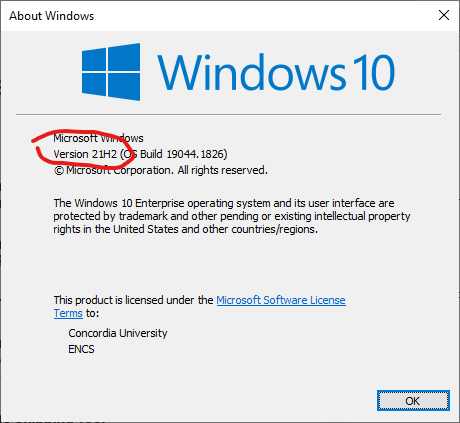
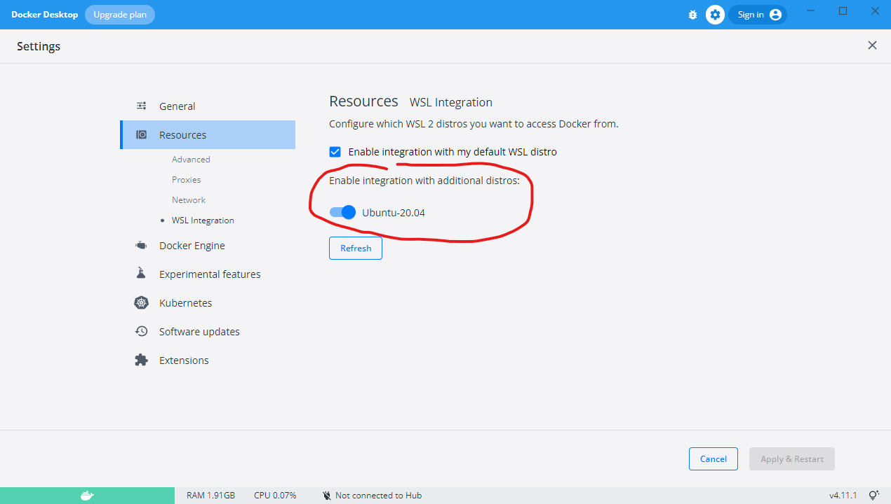

# OpenISS Graphical and ML Dockerfiles

For teaching, learnding, and HPC research as well as OpenISS deployments.

Use X11 versions to check if your graphics pipeline works between your host OS and the container, especially Windows.
Use OpenGL versions primarily for graphics rendering.
Use CUDA versions primarily for ML stuff.

The containers provided here are possible starter sample containers
that extend existing ones with samples preloaded or build new ones.
Some are very simple and basic, while others are more complete.
Feel free to choose any applicable ones and extend them.

There is a choice of either building a container locally using its `Dockerfile`
script or pulling pre-built images from DockerHub or GHCR, whichever is faster.

We then include complete OpenISS inside the container for image and motion
data processing.

If you want to reproduce the setup on Windows on your own machine
the documentation is further below.

* These instructions originally tested and created by [Jonathan Llewellyn](https://github.com/inexistenz)
* Maintenance, editorializing, OpenISS and HPC updates/support by Serguei Mokhov
* [Derived work for COMP371](https://github.com/tiperiu/COMP371_dockerimage)

# Sample containers

TL;DR

- Versioning: season-sequence number, e.g., `F22-01`
- Prebuilt images on DockerHub: https://hub.docker.com/u/openiss
- For prebuilt images on GitHub, use `ghcr.io`

## Sources

- `Dockerfile.u20-based` -- common packages for most images as a base image
- [X11](X11/) -- basic X11 graphics test
- [CUDA](CUDA/) -- CUDA-specific samples
- [OpenGL](OpenGL/) -- OpenGL-specific samples
- [ML](ML/) -- Machine learning and deep-learning related images and examples

## Small sample containers

### X11

- `openiss/openiss-xeyes:F22-01` -- X11 graphics test with the `xeyes` program 
- see the instructions in [here](./OpenGL) how to setup graphics forwarding between the container and Windows with an X server

### OpenGL

- `openiss/openiss-opengl-cubes:F22-01` -- simple cubes example
- `openiss/openiss-opengl-glfw:F22-01` -- example of using GLFW
- `openiss/openiss-opengl-triangle:F22-01` -- simple triangle
- `openiss/openiss-opengl-skeleton:F22-01` -- OpenGL Skeleton Tracking framework
- `openiss-opengl-ogl` -- OpenISS OGL extension samples
- `openiss-opengl-sample-projects` -- all inclusive

### CUDA

- `openiss/openiss-cuda-devicequery:F22-01`, includes official `cuda-samples`
- `openiss/openiss-cuda-opengl:F22-01`, includes official `cuda-samples` (OpenGL+CUDA are not supported on Windows WSL)

### ML

- `openiss/openiss-cuda-conda-jupyter:F22-01`
- `openiss/openiss/openiss-reid:F22-01`
- `openiss-lambdal-stack`

## Pulling

```
docker pull openiss/openiss-opengl-cubes:F22-01
```

To pull a specific tag, suffix it at the end of the pull:

```
docker run --rm -it --gpus all openiss/openiss-opengl-cubes:F22-01
```

## Running 

```
docker run --rm -it --gpus all openiss/openiss-opengl-cubes:F22-01
```

# Setting up

## Setting up NVidia Docker on Windows

### Step 1: Get correct Windows version

Ensure that Windows OS is Windows 10 version 21H2 or higher, or Windows 11.

You can check by looking by using `winver` in the terminal.



### Step 2: Setup WSL

From [https://docs.microsoft.com/en-us/windows/wsl/install](https://docs.microsoft.com/en-us/windows/wsl/install)

In an **administrator** PowerShell or Windows Command Prompt type:

```
wsl --install
```

Then restart the computer.

Go back to a command prompt and type:

```
wsl --set-default-version 2
```

### Step 3: Get Linux (Ubuntu 20.04 LTS)

You can either get it from the Microsoft App Store

or

Type the following into a terminal:

```
wsl --install -d Ubuntu-20.04
```

Check that Ubuntu is running on the correct version of WSL using the following
in cmd:

```
wsl -l -v
```

Ubuntu should have a "2" in the version column

### Step 4: Get Docker

Download and install docker desktop from [https://docs.docker.com/desktop/windows/wsl/](https://docs.docker.com/desktop/windows/wsl/)

Once it is downloaded, go to settings and make sure it WSL integration is set to use Ubuntu.



### Step 5: Setup CUDA

Install the appropriate NVidia drivers and CUDA Toolkit on Windows. And then do the same for Ubuntu.

Follow the steps given at...

[https://docs.nvidia.com/cuda/wsl-user-guide/index.html](https://docs.nvidia.com/cuda/wsl-user-guide/index.html)

or

[https://ubuntu.com/tutorials/enabling-gpu-acceleration-on-ubuntu-on-wsl2-with-the-nvidia-cuda-platform](https://ubuntu.com/tutorials/enabling-gpu-acceleration-on-ubuntu-on-wsl2-with-the-nvidia-cuda-platform)

### Step 6: Test that the GPU is accessible from Ubuntu

In a Windows command prompt type:

```
nvidia-smi
```

And then in the Ubuntu terminal type the same command.

The results should  be the same. If it is then setup is done.

### Step 7: Run the Docker NVidia test.

In a Windows command prompt run the following:

```
docker run --rm -it --gpus=all nvcr.io/nvidia/k8s/cuda-sample:nbody nbody -gpu -benchmark
```

This should also work in an Ubuntu terminal.

## Setting up on macOS

TODO

## Setting up on Linux

TODO

## References

TODO
